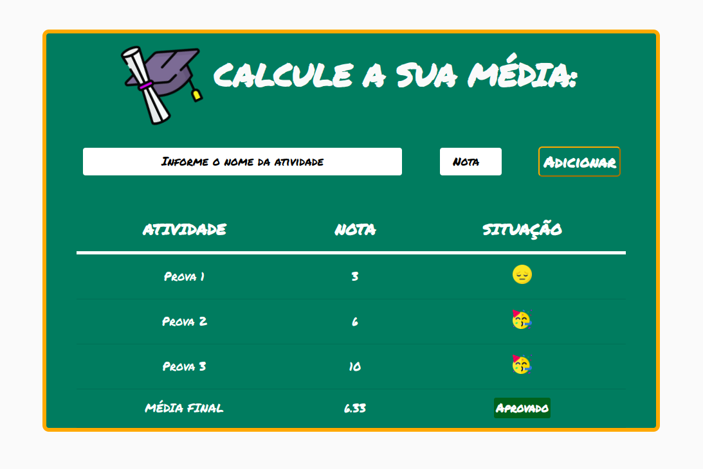

<h1 align="center">
    <a href="https://ebac-projeto-2-seven.vercel.app/" alt="Cálculadora de atividades escolares">🔢 Calculadora de média 🧮</a>
</h1>

<h3 align="center">
    <p>Sistema web que realiza o cálculo da média (aritmética simples) de atividades escolares.</p>
</h3>

<p align="center">
  
  
  <a href="https://github.com/bcadore/EBAC-Projeto-2/commits/main">
    
  </a>
   
   <a href="https://github.com/bcadore/EBAC-Projeto-2/stargazers">
    
  </a>
  <a href="#">
    
  </a>
</p>

<h4 align="center">
	🚧 Projeto não finalizado 🚧
</h4>

## 💻 Sobre o projeto

- Trata-se de um **sistema web**, onde será realizado o cálculo da média aritmética simples dos valores obtidos das atividades (provas ou trabalhos, por exemplo), informadas pelo usuário.

- O sistema levará um valor informado pelo usuário, como valor mínimo para "aprovação".

- Se o valor da média final, calculado pelo sistema, for menor que o valor informado pelo usuário, será exibido o resultado como **"reprovado"**.

- Se o valor da média final, calculado pelo sistema, for maior ou igual ao que o valor informado pelo usuário, será exibido o resultado como **"aprovado"**.

- A média do usuário é calculado através da fórmula da média aritméitica, ou seja:

```
Média = (X1 + X2 + X3 + ... + Xn) / n

onde:

Xn = Soma total dos valores
n = Número total dos valores do conjunto
```
<br>O objetivo principal do projeto foi colocar em prática o aprendizado obtido no curso **"Engenheiro Front-End"** da **EBAC** e usar a linguagem JavaScript para a interação do usuário com a página web.

<br>Foi utilizado o Git/GitHub como a ferramenta de versionamento e também foi utilizado a plataforma da Vercel para hospedar a página web.

## ⚙️ Estrutura do projeto

- O projeto é composto por:
  - Uma página web: **index.html**
  - Um arquivo de estilização: **main.css**
  - Um arquivo contendo a lógica do sistema: **main.js**
  - Uma pasta **(Assets)** com as imagens utilizadas na construção da página web.

## 🎲 Funcionalidades

As funcionalidades desenvolvidas no projeto são:

### Desenvolvidas:
- [x] **Interface de Adição de Atividades:** Os usuários podem inserir o nome e a nota de uma atividade em um formulário claro e organizado na página.

- [x] **Validação de Entradas:** O sistema valida as entradas do usuário, garantindo que a nota inserida esteja dentro do intervalo válido (0 a 10).

- [x] **Adição de Atividades:** Após preencher o formulário e clicar em "Adicionar", as atividades são adicionadas à tabela de forma ordenada e com indicação visual de aprovação ou reprovação.

- [x] **Feedback Visual:** O sistema fornece feedback visual imediato ao usuário, exibindo emojis de "aprovado" ou "reprovado" na tabela de acordo com a nota inserida.

- [x] **Cálculo da Média Final:** A média final é calculada automaticamente com base nas notas das atividades adicionadas, sendo exibida na tabela junto com um feedback visual indicando se o usuário foi aprovado ou reprovado.

- [x] **Estilização Atraente:** A página possui uma estilização atraente, com uso de cores, fontes e layout que tornam a experiência do usuário mais agradável e facilitam a compreensão das informações apresentadas.

- [x] **Performance:** O projeto é otimizado para garantir um carregamento rápido e uma execução suave, proporcionando uma experiência fluida ao usuário durante a interação com a calculadora de médias.

- [x] **Código Organizado:** O código HTML, CSS e JavaScript está bem organizado e comentado, facilitando a manutenção e o entendimento por parte de outros desenvolvedores que possam trabalhar no projeto no futuro.

### Não realizadas:
- [ ] **Responsividade:** O layout da página é responsivo, adaptando-se a diferentes tamanhos de tela, garantindo uma boa experiência de uso tanto em dispositivos móveis quanto em desktops.

- [ ] **Edição e Remoção de Atividades:** Permitir que o usuário edite ou remova atividades já adicionadas, proporcionando mais flexibilidade e controle sobre os dados inseridos.

- [ ] **Feedback Detalhado:** Além do feedback visual de aprovação ou reprovação, fornecer um feedback mais detalhado sobre o desempenho do usuário, como uma mensagem indicando a diferença entre a média final e a nota mínima para aprovação.

- [ ] **Salvar e Carregar Dados:** Adicionar a capacidade de salvar os dados das atividades inseridas localmente (por exemplo, usando localStorage) para que o usuário possa retornar à página e continuar de onde parou em uma sessão anterior.

- [ ] **Personalização da Nota Mínima:** Permitir que o usuário defina e ajuste a nota mínima de aprovação de acordo com suas necessidades, em vez de solicitar a nota mínima via prompt.

- [ ] **Exportar Resultados:** Adicionar a funcionalidade de exportar os resultados da calculadora, seja para um formato de arquivo (como CSV ou PDF) ou compartilhamento direto por e-mail ou redes sociais.

## 🛠 Tecnologias

Foi utilizado na construção do projeto as seguintes tecnologias:

## 🛠 Tecnologias

Foi utilizado na construção do projeto as seguintes tecnologias:

<code></code> **HTML**
<code></code> **CSS**
<code></code> **JavaScript**
<code></code> **Git**
<code></code> **GitHub**

## 👀 Visualizando o projeto

Abaixo é possível visualizar a página web que foi desenvolvida:



## 🌐 Hospedagem

Este projeto encontra-se hospedado na plataforma da **[Vercel](https://vercel.com)**.

#### Pode ser visualizado clicando aqui: **[Cálculadora de notas escolares](https://ebac-projeto-2-seven.vercel.app/)**

## 🙋🏻‍♂️ Autor

<a href="https://github.com/bcadore">
    
    <br/>
    <sub><b>Bernardo Cadore Ramires</b></sub>
</a>

## [](https://www.linkedin.com/in/bernardocadore/)

## 📝 Licença

Este projeto esta sobe a licença [MIT](./LICENSE).


## ⚠️ Outras considerações

👉 **A responsividade da página não foi levada em consideração.**

👉 **Este projeto é parte de uma tarefa educacional, foi desenvolvido apenas para testar na prática as habilidades aprendidas em aula. Sinta-se à vontade para fornecer um feedback construtivo ou sugestões de melhorias.**

<br>
<p align=center>
❤️  <b>MUITO OBRIGADO</b> por visitarem o meu projeto! ❤️
</p>
